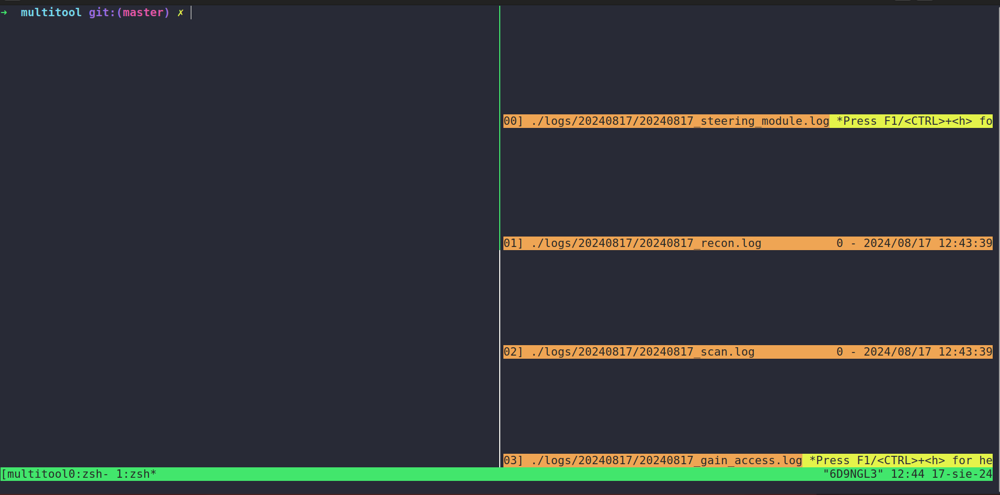
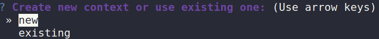
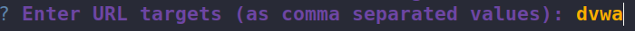
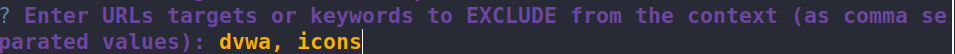
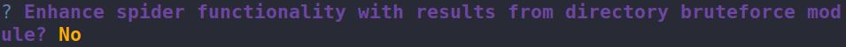
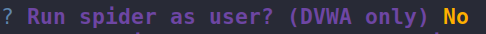
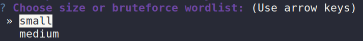
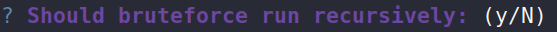
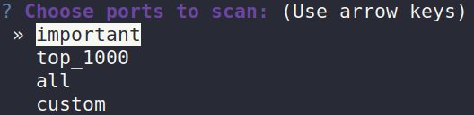
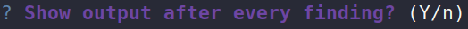

# Hacking MultiTool
> ⚠️ WORK IN PROGRESS...

## Description
Project is currently in POC stage. New features will be added in the future, expanding application capabilities.

The idea behind this project was to create an automated tool providing aggregated results for initial engagement in
Ethical Hacking and Bug Bounty programs. With time expanding those with even more complex features.

At this time, application is set to run against DVWA (Damn Vulnerable Web Application), and treat it as a test environment.
Purpose of this application was to create a playground to lear Cybersecurity in safe space.

## Features
Currently, application contains following features, divided into phases:
- **Recon Phase**
  - Directory Bruteforce
    - custom solution
    - using ZAP Spider
  - Email Scraping

- **Scan**
  - Port Scan

- **Gain Access**
  - LFI [Local File Inclusion] (Currently works only as single module, when correct URL address is provided)

## Installation
1. Application runs in Docker containers. Docker installation guide can be found [here](https://docs.docker.com/engine/install/)
2. Copy `env.template` file and rename it to `.env` in the same directory
3. Modify the parameters in the `.env` file to fit your environment

## Usage
To run the program below commands need to be executed from project directory

0. All commands can be listed with
```bash
make help
```


1. Build all necessary containers. This command is required to be run only once.
```bash
make bulid
```


2. Run dependant containers, after that all is ready to run `MultiTool`
```bash
make setup
```


3. Application spawns nested terminal windows to simultaneously show results from all modules<br/>



4. On left hand side there's a functional terminal. To run main program and start the configuration process, execute:
```bash
make run
```
This command can be run multiple times until `make stop` is executed


5. At this stage user needs to configure the tool using a series of questions


6. First is use type. `MultiTool` can run utilizing all features, whole phase or single module<br/>


7. Program uses "context" feature. In case of first scan, select `new`<br/>



8. Select URLs to scan. ⚠️ DO NOT USE ANY TARGETS BESIDE DVWA <br/>
`dvwa` can be written directly as a target (not the URL)<br/>



9. Provide a list of excluded directories from the scan<br/>



10. Decide if ZAP Spider scan should be reinforced with results form directory bruteforce<br/>



11. Decide if ZAP Spider scan should be run as a logged-in user<br/>



12. Select type of wordlist that will be used for directory bruteforce<br/>



13. Decide if directory bruteforce will run recursively<br/>



14. Select ports that will be scanned from a list or provide custom values<br/>



15. Decide if every finding should be shown immediately or not<br/>



16. Scan results can be found in the `results` directory


17. Stop all containers and shut down the application
```bash
make stop
```

## Development
Before running tests, if application is still running it must be stopped with
```bash
make stop
```

To run all tests, run:
```bash
make tests
```

## License
This project is licensed under the MIT License - see the [LICENSE](LICENSE) file for details.

## Acknowledgements
- [DVWA](https://github.com/digininja/DVWA)
- [ZAP Spider](https://github.com/zaproxy/zaproxy)

## Roadmap
Below is a rough list of incoming features. This list is not set in stone, so its order and content can change with time.

- Provide custom "context" solution instead of using ZAP
- Change ZAP Spider to [Photon](https://github.com/s0md3v/Photon)
- Credetial leaks check (based on scraped emails)
- RFI [Remote File Execution]

## Disclaimer
This software is intended solely for ethical security research, white-hat hacking, and participation in authorized bug bounty programs.
Unauthorized use of this software for malicious purposes, including but not limited to hacking, unauthorized system access,
and data breaches, is strictly prohibited and against the law.

By using this software, you agree to only engage in legal and ethical activities.
The author(s) and contributors are not liable for any misuse or damage caused by the use of this software.

Always obtain proper authorization before testing the security of any system.
